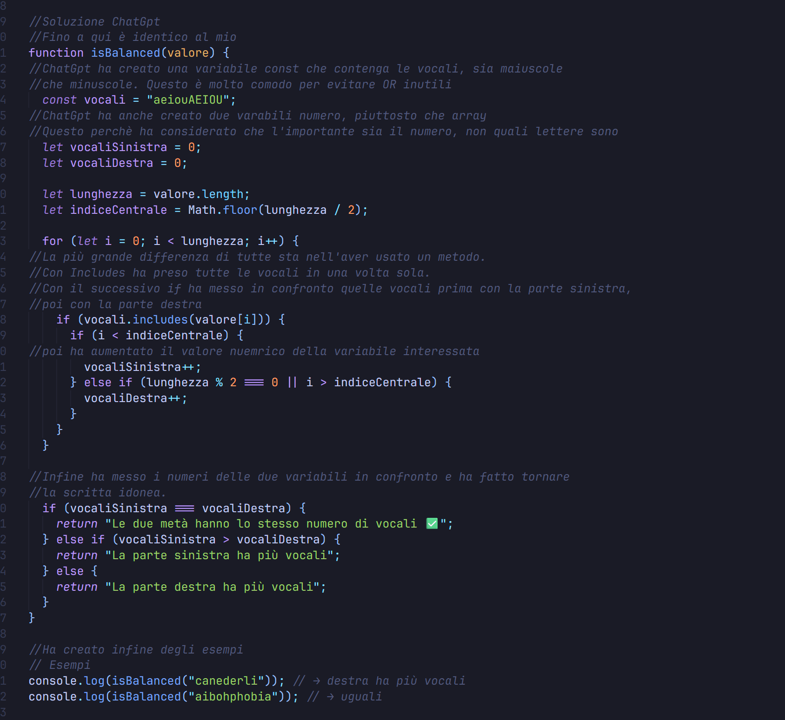

Esercizi di Agosto del sito https://www.freecodecamp.org/learn.

Scopo degli esercizi: 
  -  Acquisire competenze logiche di programmazione
  -  Migliorare la scrittura del codice
  -  Imparare il corretto utilizzo dei metodi
  -  Divertirsi!!!

Come viene strutturato l'esercizio?
  - Analisi della consegna
  - prima stesura in pseudo codice
  - Inserimento codice in FreeCodeCamp
  - Correzione esercizio in ChatGpt
  - Copia esercizio personale e di ChatGpt su Visual Studio
  - Analisi del mio codice e di quello di ChatGpt con domande sull'operato
  - Richiesta valutazione da parte di ChatGpt
  - Pushare su GitHub l'esercizio.

ATTENZIONE!!! 
Tutti gli snack sono stati risolti da una persona che sta imparando e, in breve, non possiede le competenze tecniche a livello avanzato.
Questi esercizi servono proprio a migliorare le lacune e a migliorare il pensiero logico. 

